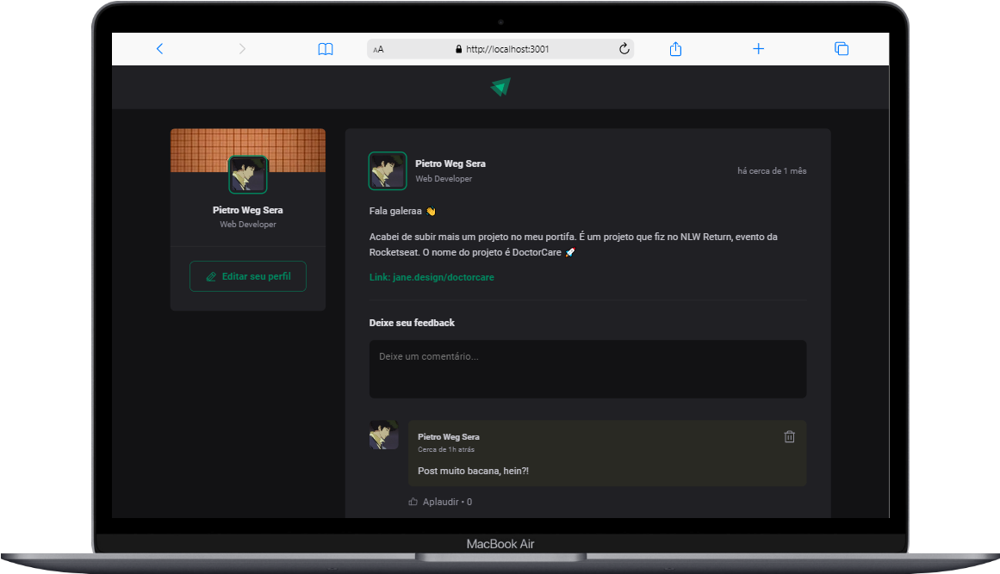
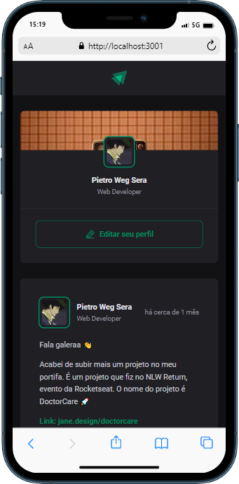

<h1 align="center">Ignite Feed</h1>

    Esse projeto foi desenvolvido durante o <b>módulo 1: Fundamentos do ReactJs</b> no bootcamp Ignite (Rocketseat) com o objetivo de praticar os conceitos mais importantes do react, entre eles estão componentização, estados, imutabilidade e hooks além do uso de Typescript.
  

  <a href="#-tecnologias-e-bibliotecas">Tecnologias</a>&nbsp;&nbsp;&nbsp;|&nbsp;&nbsp;&nbsp;
  <a href="#-como-executar">Como executar</a>

  

 

  
  

## ✨ Tecnologias e bibliotecas

Para a construção do projeto, foram utilizadas as seguintes tecnologias:

- [ReactJs](https://pt-br.reactjs.org/)
- [TypeScript](https://www.typescriptlang.org/)
- [Vite](https://vitejs.dev/)
- [Date-fns](https://date-fns.org/)
- [uuidv4](https://www.npmjs.com/package/uuidv4)
- [phosphor-react](https://www.npmjs.com/package/phosphor-react)

 

## 📄 Como executar
Para executar o projeto, rode o seguinte código no terminal:
`npm run dev`

---